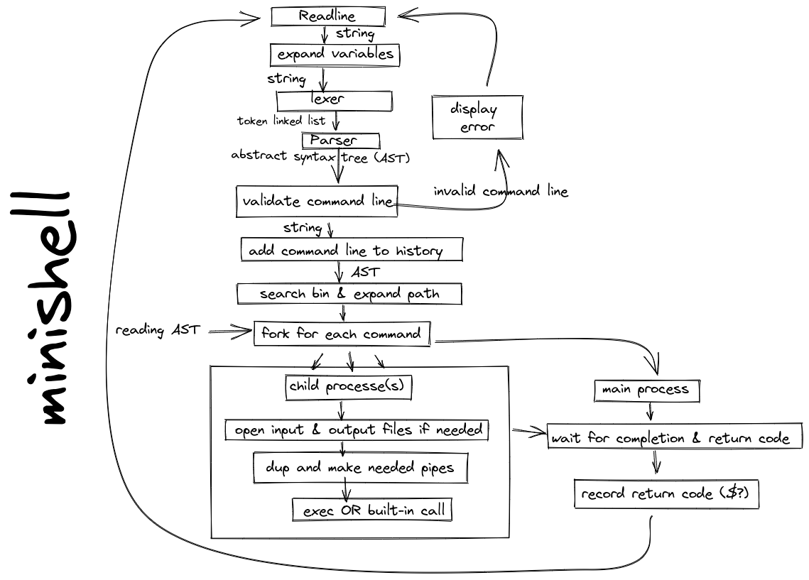
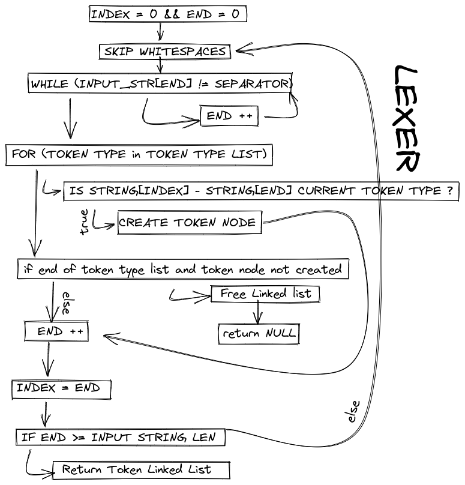
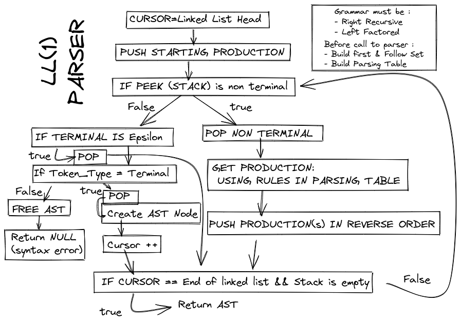

# MINISHELL 

## Overview 


## Lexer Algorithm 


## LL(1) Parser Algorithm


## Grammar

```
%%

COMMAND_LINE     
                 : COMPLETE_COMMAND PIPED_CMD
                 ;
PIPED_CMD        
                 : PIPE COMPLETE_COMMAND PIPED_CMD
                 |
                 ;
COMPLETE_COMMAND 
                 : REDIRECTION CMD REDIRECTION CMD_ARG REDIRECTION
                 ;
REDIRECTION      
                 : REDIRECTION_TOKEN
                 | 
                 ;
CMD              
                 : WORD
                 ;
CMD_ARG          
                 : WORD REDIRECTION CMD_ARG
                 | SINGLE_QUOTED REDIRECTION CMD_ARG
                 | DOUBLE_QUOTED REDIRECTION CMD_ARG
                 | REDIRECTION
                 ;

```

### First & Follow sets :

| Symbol            | First Set                             | Follow Set                                            |
|-------------------|---------------------------------------|-------------------------------------------------------|
| COMMAND_LINE      | REDIRECTION_TOKEN, WORD               | $                                                     |
 | COMPLETE_COMMAND  | REDIRECTION_TOKEN, WORD               | $                                                     |
| REDIRECTION       | REDIRECTION_TOKEN, ε                  | WORD, SINGLE_QUOTED, DOUBLE_QUOTED                    |
 | PIPED_CMD         | PIPE,  ε                              | $                                                     |
| CMD               | WORD                                  | REDIRECTION_TOKEN, WORD, SINGLE_QUOTED, DOUBLE_QUOTED |
 | CMD_ARG           | WORD, SINGLE_QUOTED,DOUBLE_QUOTED,  ε | REDIRECTION_TOKEN, PIPE, $                            |

### Parsing Table 

1. COMMAND_LINE -> COMPLETE_COMMAND PIPED_CMD
2. PIPED_CMD -> PIPE COMPLETE_COMMAND PIPED_CMD
3.            |  ε
4. COMPLETE_COMMAND -> REDIRECTION CMD REDIRECTION CMD_ARG REDIRECTION
5.                   |  ε
6. CMD -> WORD
7. CMD_ARG -> WORD REDIRECTION CMD_ARG
8.          | SINGLE_QUOTED REDIRECTION CMD_ARG
9.          | DOUGLE_QUOTED REDIRECTION CMD_ARG
10.         |  ε


** LL(1) Parsing Table ** 

|                  | PIPE | REDIRECTION_TOKEN | WORD | SINGLE_QUOTED | DOUBLE_QUOTED | $   |
|------------------|------|-------------------|------|---------------|---------------|-----|
| COMMAND_LINE     |      | 1                 | 1    |               |               |     |
| PIPED_CMD        | 2    |                   |      |               |               |     |
| COMPLETE_COMMAND |      | 4                 | 4    |               |               |     |
| REDIRECTION      | 6    | 5                 | 6    | 6             | 6             | 6   |
 | CMD              |      |                   | 7    |               |               |     |
| CMD_ARG          |      |                   | 8    | 9             | 10            |     |